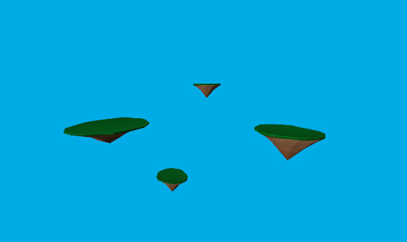
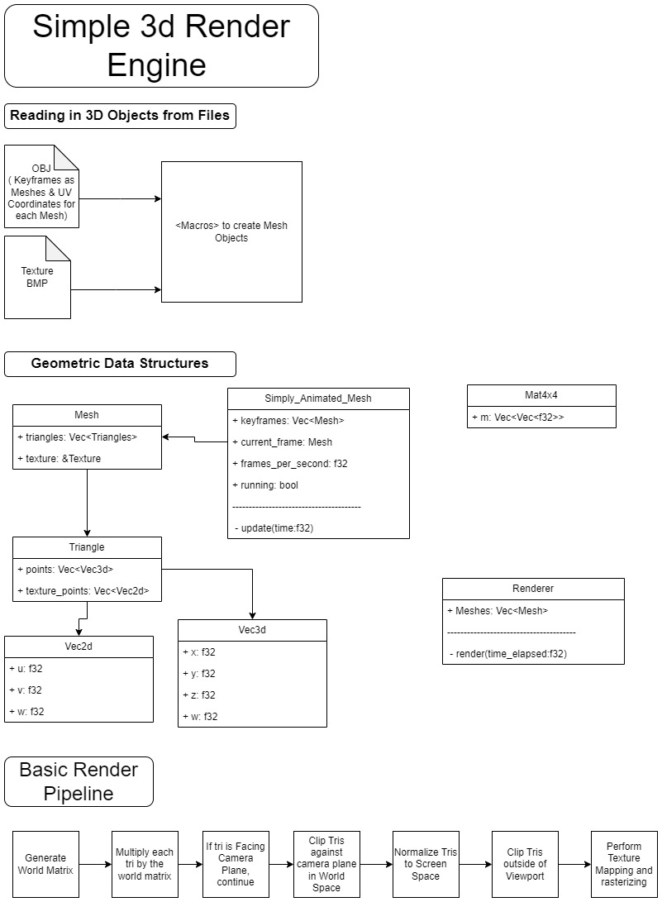

# rusterer
A 3D software renderer and rasterizer written in Rust.

To build the sample app and run on it on the desktop:
```
cargo run --example desktop --release
```

To build the sample app and run it on the web:
```
cargo install devserver
cd examples/web
wasm-pack build --target web --out-name req_anim_frame.wasm -- --features web --no-default-features
mkdir rusterer_server
cp src/index.html rusterer_server/.
cp pkg/req_anim_frame.wasm rusterer_server/req_anim_frame.wasm_bg.wasm
cp pkg/req_anim_frame.js rusterer_server/.
cd rusterer_server
devserver
```
With the devserver running you can open the demo at: 

http://localhost:8080/
### Rusterer in Action:
Here is an example of the rusterer app running on the web browser: 
 

You can access the demo here: https://paulbryden.github.io/rusterer/ 

Use the WASD and the UP and DOWN arrows to navigate the environment. 

### Rusterer Architecture:
A simplified design diagram of the rendering engine can be seen below: 




### Inspiration:

[1] https://github.com/OneLoneCoder/olcPixelGameEngine 

[2] http://www.sunshine2k.de/coding/java/TriangleRasterization/TriangleRasterization.html 